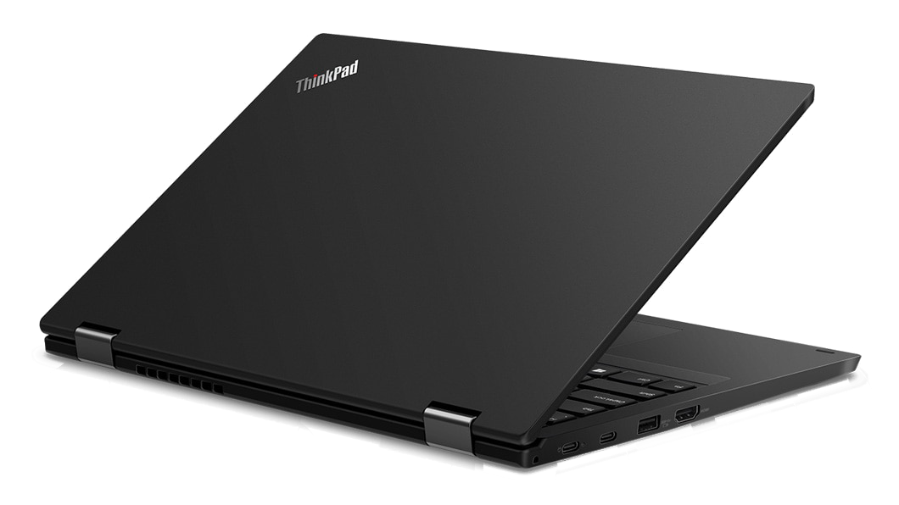
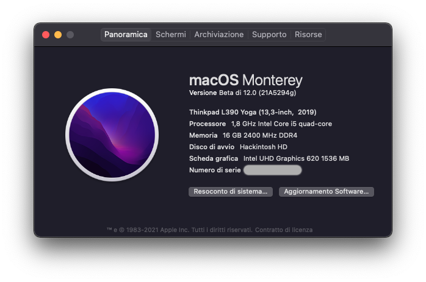
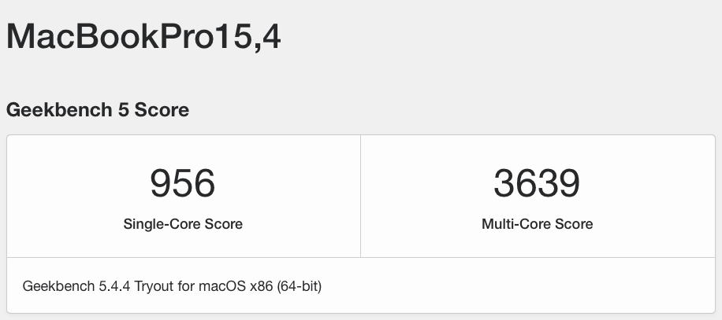

# Thinkpad-L390-Yoga-macOS-Opencore
This repository contains the files needed to successfully boot macOS on Lenovo Thinkpad L390 Yoga with Opencore.
After installing Mac OS 12 and 13, which work well with the current setup, I decided to use <b>Mac OS 11</b> because it guarantees the best compatibility with bluetooth services (handoff, universal clipboard, sidecar...).

 &nbsp;&nbsp; &nbsp;&nbsp;

The project is stable. Mac OS 11 works with Windows 11 in dual boot. There are probably things that can be improved, so feel free to open issues or even PRs with suggestions or observations.  <b>This is not a support forum</b>, I won't be able to give individual support. I suggest to use the <a href="https://dortania.github.io/OpenCore-Install-Guide/">Dortania's Opencore Install Guide</a> to build your EFI folder, then compare with this EFI for the last improvements.

<h2>Configuration</h2>

| Specifications      | Details                                          |
| :--- | :--- |
| Processor           | Intel Core i5-8265U @ 1.8 GHz          |
| Memory              | 16 GB DDR4 2400 MHz                             |
| Hard Disk           | Crucial P2 SSD PCIe NVMe 512 GB         |
| Integrated Graphics | Intel UHD Graphics 620 |
| Screen              | 13.3 inch with Touchscreen @ 1920 x 1080         |
| Sound Card          | Realtek ALC257 @ layout-id 96                             |
| Wireless/BT Card       | BCM94350ZAE (Lenovo FRU 00JT494)           |

<h2>Status</h2>
<h3>What works</h3>
Almost everything, including gestures, multitouch, touchscreen, bootchime (thanks @mikebeaton), external video output, EC keys, sleep, hibernation ...
<h3>What doesn't work but might be fixed in the future</h3>

- Realtek Card Reader: it works with <a href="https://github.com/0xFireWolf/RealtekCardReader">this driver</a> by 0xFireWolf. However, I have noticed an increase in power consumption (about 0.5w on idle) with the card reader enabled and the kext, so I prefer to disable it;
- Some features of YogaSMC kext: for info, follow <a href="https://github.com/zhen-zen/YogaSMC/issues/68#">this issue</a> and feel free to contribute;
- Continuity features: you need a genuine Apple Airport card to make them work. I tried to install multiple Apple network cards in this laptop, but the m.2 interface is probably incompatible (everything is described below)

<h3>What doesn't work</h3>

- Fingerprint sensor (disabled in BIOS);
- T2 chip related functions (ApplePay for example);
- Hardware DRM support (<a href="https://dortania.github.io/OpenCore-Post-Install/universal/drm.html">info</a>);
- Other features related to the native hardware of the Macs that you will find out.

<h2>Useful informations</h2>
<h3>BIOS</h3>

- Disable Secure Boot;
- Disable VTd;
- Disable Wake On Lan;
- UEFI/Legacy Boot: UEFI Only;
- CSM Support: it should be disabled, however enable the CSM support avoids the black screen after hibernation (<a href="https://github.com/tylernguyen/x1c6-hackintosh/issues/44#issuecomment-697270496">technical info</a>). There is also an alternative patch at the end of config.plist, which I use in my configuration when I enable hibernation.

<h3>SSDTs</h3>

  - <b>SSDT-INIT/b>: disables RTC device, HPET, injects a OSDW method (useful to check if the system is MacOS) + personal patch to avoid instant wake after sleep with certain usb devices plugged. It patches _PRW methods and must be associated with the relative ACPI patch in config.plist;
  - <b>SSDT-DEVICES</b>: patches ADP1 to allow ACPIACAdapter to attach to the device; injects PWRB, DMAC, MCHC, and BUS0 devices (not sure if it makes the difference); injects PGMM, PMCR, SRAM for cosmetic reasons;
  - <b>SSDT-HWAC</b>: patches the access in the only 16-bit field of EC;
  - <b>SSDT-KEYS</b>: makes the brightness keys work (alternative: <a href="https://github.com/acidanthera/BrightnessKeys">Brightness Keys kext</a>) and patches wrong keys for VoodooPS2Controller;
  - <b>SSDT-PNLF</b>: from the cross-platform <a href="https://github.com/acidanthera/OpenCorePkg/blob/master/Docs/AcpiSamples/Source/SSDT-PNLF.dsl">SSDT</a>, only for Coffee Lake;
  - <b>SSDT-YogaSMC</b>: useful SSDTs from <a href="https://github.com/zhen-zen/YogaSMC/tree/master/YogaSMC/SSDTSample">YogaSMC</a> merged together.

<h3>config.plist</h3>

  - <b>Device Properties</b>
    - (0x0)/(0x2,0x0) -> patches platform-ID (0x3E9B0009) and device-ID (0x3E9B) for WhiskeyLake UHD620 (faked as a UHD630). <a href="https://github.com/acidanthera/WhateverGreen/blob/master/Manual/FAQ.IntelHD.en.md">Whatevergreen FAQ</a> suggests to use another value for <i>device-ID</i>, however I encounterd problems with the suggested values (black screen on boot, blackscreen after wake with backlight on...); patches connectors as suggested in the Dortania guide; patches DVMT allocation; <i>force-online</i> is useful if you use external monitor, otherwise it's better to remove it;
    - (0x0)/(0x12,0x0) -> allows AppleIntelPCHPMC to attach to PMCR (pci8086,9df9), not sure if useful;
    - (0x0)/(0x1C,0x6)/(0x0,0x0) -> for BCM94350ZAE <b>with pin 53 masked</b>; change aspm if you don't mask the pin; remove if you use other Wireless Cards;
    - (0x0)/(0x1F,0x3) -> audio: I created <i>layout-id = 96</i> specifically for this laptop, but it should also work on other Thinkpads with the same platform (such as X390, T490, and so on... )
  - <b>Kernel</b>/<b>Quirks</b>:
    - AppleCpuPmCfgLock / AppleXcpmCfgLock -> Interestingly, <a href="https://github.com/simprecicchiani/ThinkPad-T460s-macOS-OpenCore/issues/8">system boots even though these two patches are disabled and CFG Lock is enabled</a>. Patching CFGLock (or DVMT), maybe, is possible only with a <a href="https://github.com/tylernguyen/x1c6-hackintosh/blob/main/docs/BIOS.md#modding-the-bios">CH341A + SOIC programmer</a>. Anyway, <a href="https://github.com/digmorepaka/thinkpad-firmware-patches">there isn't any public BIOS full patch</a> (with advanced menu) available for this laptop</a>;
  - <b>Kernel</b>/<b>Add</b>:
    - BrcmPatchRAM, BrcmFirmwareData, AirportBrcmFixup are useful for non-native Broadcom network cards, remove if not needed;
    - BlueToolFixup: <a href="https://github.com/acidanthera/BrcmPatchRAM/pull/12">required for Bluetooth</a> with non-native network cards in Monterey and newer. In Big Sur (and older) use BrcmBluetoothInjector.kext;
  - <b>NVRAM</b>
    - rtc-blacklist -> for hibernation. You can remove the content of this entry, along with HibernationFixUp and RTCMemoryFixUp kexts, if you don't use hibernation;
    - hbfx-ahbm = 1445 -> Auto-hibernation. The value means 1: Enable; +4: When External Power is disconnected; +32: When Battery At Critical Level; +128: DisableStimulusDarkWakeActivityTickle, not sure if useful; +256+1024 = 5%;
    - prev-lang:kbd -> change with your language, I'm Italian so I keep it-IT:0;

<h2>Hardware notes</h2>

- <b>If your laptop has a Samsung PM981 NVMe SSD you have to buy another one</b>, because that drive <a href="https://github.com/tylernguyen/x1c6-hackintosh/issues/43">doesn't work with macOS</a> at all.
- <b>Important info about the network card</b>:
  - The original network card (Intel wireless 9560NGW) works with <a href="https://github.com/OpenIntelWireless">OpenIntelWireless</a>. Anyway, if you're interested in features such as Airdrop or Handoff, a supported Broadcom card is a better choice. Check <a href="https://dortania.github.io/Wireless-Buyers-Guide/types-of-wireless-card/m2.html">Dortania Wireless Buyers Guide</a>.
  - I have tested multiple Broadcom network cards, and the results probably show some hardware limitations of this laptop. In particular:
    - I tried two <b>BCM94360NG</b> cards. The card doesn't work in this laptop: the <ins>PCIe wireless device isn't enumerated</ins> at all in PCIe bus. Bluetooth (USB), instead, works.
    - I also tested two <b>BCM94360CS2</b> cards and a <b>BCRM943602CS</b> card, with two different adapters, in every possible combination. In this case, the PCIe wireless interface is recognized and works, instead <ins>Bluetooth isn't recognized</ins> at all (HS10 USB port is empty). The above applies to both MacOS, Windows and Linux. Consider that this card doesn't fit the laptop and probably needs some DIY.
    - The culprit could be the CNVio interface of the M.2 connector of this laptop. However, this doesn't explain why the wireless interface of BCM94360CS2 and BCM943602CS (PCIe) was recognized! Another problem could be the BIOS of the laptop, but I don't have the knowledge to find out.
    - I'm currently using a <b>BCM94350ZAE</b> card, and in particular an OEM card (Lenovo FRU 00JT494). It still can be found in Aliexpress and it's cheap. This card <ins>works</ins> with AirDrop, Handoff and Universal Clipboard support (at least in Big Sur, Monterey is more problematic). However, Personal Hotspot and Apple Watch Unlock don't work (you need an original Apple Airport card). The guide suggests to set aspm to 0 because the BCM94350ZAE chipset doesn't support power management correctly in macOS. However, I think that it is probably better to mask pin 53 (more info: <a href="https://github.com/acidanthera/bugtracker/issues/794">here</a> and <a href="https://github.com/acidanthera/bugtracker/issues/1646#issuecomment-877663608">here</a>). If you mask pin 53, you can avoid to use AirPortBrcmFixup kext (Bluetooth kexts still needed).

- These three I2C devices under PCI0 should be removed but I haven't found a way to solve this. VoodooI2C is necessary to make the touchscreen work. <a href="https://github.com/VoodooI2C/VoodooI2C/issues/408">More info</a>.
 - Battery lasts about 3-4h with a full charge, with a 0.8-1.1W idle power consumption. Undervolting with Voltageshift is a good idea.

<h2>Thanks to</h2>

- <a href="https://github.com/acidanthera">acidanthera</a>
- <a href="https://dortania.github.io/OpenCore-Install-Guide/">Dortania's OpenCore Install Guide</a>
- zhen-zen for <a href="https://github.com/zhen-zen/YogaSMC">YogaSMC</a>
- <a href="https://github.com/VoodooI2C/VoodooI2C">VoodooI2C</a> for the touchscreen driver
- sicreative for <a href="https://github.com/sicreative/VoltageShift">VoltageShift</a>
- benbender and tylernguyen for their well-documented <a href="https://github.com/benbender/x1c6-hackintosh">thinkpad x1c6 hackintosh project</a>
- <a href="https://github.com/5T33Z0/OC-Little-Translated">OC-Little-Translated</a>

<h2>Benchmark</h2>

Compare with <a href="https://browser.geekbench.com/v5/cpu/search?utf8=%E2%9C%93&q=MacBook+Pro+2019+i5+i5-8257U">these</a>.
